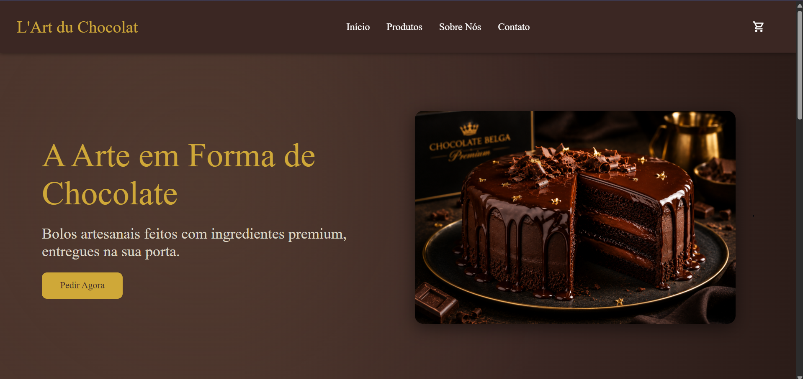

# 🍫 L'Art du Chocolat

Um e-commerce moderno de bolos artesanais premium, desenvolvido com foco em experiência do usuário, design elegante e simulação completa de compra online.

A aplicação apresenta uma interface sofisticada e responsiva, permitindo que usuários naveguem por categorias, adicionem produtos ao carrinho e finalizem pedidos em um fluxo intuitivo e realista.

  

---

## 🌐 Acesse o projeto

Você pode visualizar o projeto online:

👉 https://thamiresantos.github.io/LArt-du-Chocolat/

---

## 🚀 Tecnologias Utilizadas

* HTML5
* CSS3
* JavaScript
* Google Material Symbols (ícones)

---

## 🎯 Funcionalidades

* 🛍️ Catálogo de produtos dinâmico (gerado via JavaScript)
* 🎛️ Filtro por categorias (Clássicos, Gourmet, Veganos e Festas)
* 🛒 Carrinho de compras interativo com atualização em tempo real
* 📦 Simulação de finalização de pedido
* 💳 Seleção de forma de pagamento (Crédito, Débito e PIX)
* 🚚 Escolha entre entrega ou retirada
* 📱 Interface responsiva (mobile e desktop)
* 🔔 Modais interativos (checkout e confirmação)
* 📊 Indicador de itens no carrinho (badge)

---

## 🧠 Arquitetura e Conceitos

O projeto foi estruturado com foco em separação de responsabilidades:

* **HTML** → Estrutura semântica
* **CSS** → Estilização e responsividade
* **JavaScript** → Lógica de negócio e interatividade

### Destaques técnicos

* Manipulação de DOM para renderização dinâmica de produtos
* Controle de estado do carrinho via JavaScript
* Uso de atributos `data-*` para filtros dinâmicos
* Arquitetura baseada em eventos (event-driven)
* Simulação de fluxo real de e-commerce

---

## ⚠️ Observação

Este projeto é uma simulação de e-commerce. Nenhuma transação real é realizada.

---

## 👩‍💻 Contato

* [Github](https://github.com/thamiresantos)
* [Instagram](https://www.instagram.com/codewiththa/)
* [Linkedin](https://www.linkedin.com/in/thamires-santos-a9a652263) 

---

### © 2026 -Este projeto foi desenvolvido por Thamires Santos. 🌷

